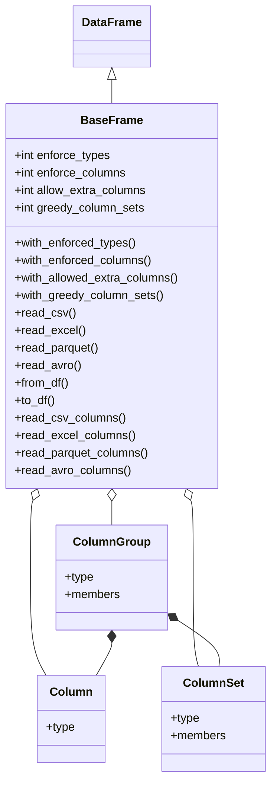

# pandandic

pandandic is a library for documenting dataset schemas in code, by inheriting from a base class and assigning attributes for columns and column sets.

## Installation

`pip install pandandic` or `pip install pandandic[extras]`

`poetry add pandandic` or `poetry add "pandandic[extras]"`

### Extras

* `parquet`
* `avro`
* `extras` provides `parquet` and `avro`
* `all` provides `parquet` and `avro`

## What Problem Does It Solve?

Consider a project that reads data from several datasets, performs some preprocessing, runs a model and returns a result.
The preprocessing must act on certain columns and so the team rightfully add constants in order to perform slicing on the input dataframes.
Two of these datasets share a column name.
One of the datasets consists of time series data, and each time the dataset is refreshed the number of columns changes.
This scenario presents several challenges with how to structure the processing logic in a clear and adaptable manner whilst maintaining clear ownership.
Here is how `pandandic` helps:

1. **Schema ownership**: with `pandandic`, each schema has a corresponding class.
2. **Shared variables**: with `pandandic`, there are no shared constants. Each `BaseFrame` subclass is responsible for its own schema.
3. **Dynamic groups**: with `pandandic` it is possible to define a set of columns with regular expressions. This schema will match dynamically on the data it is applied to, yet can still be accessed like an attribute.
4. **Group processing**: with `pandandic` it is possible to define custom groups such as "all numeric", "all time-series", in order to easily apply processing tasks to groups of data in a self-documenting fashion.

## Other Things It Does

* Wraps `parquet` reading: `pip install pandandic[parquet]`, `poetry add "pandandic[parquet]"`
* Wraps `avro` reading: `pip install pandandic[avro]`, `poetry add "pandandic[avro]"`  
For both: `pip install pandandic[all]`, `poetry add "pandandic[all]"`
* Wraps excel reading, although there are no extras configured for this due to the various output formats of excel and different packages providing them.

## What Doesn't It Do?

* **Validation**, save for what is built in to pandas. For validation of defined types, please see other libraries such as pandera, dataenforce, strictly-typed-pandas (apologies for any I have missed).
* **Appending columns**: if columns are appended to the object after calling `read_x` or `from_df` that should be captured by a `ColumnSet`, they won't be captured. This can be solved by transforming to a dataframe and back again with `to_df` and `from_df` respectively.
* **Dask**: although support may be added in future.

## Worked Examples

### Basic

`examples/basic.csv`

|foo       |bar|baz|
|----------|---|---|
|a         |1  |one|
|b         |2  |two|
|c         |3  |three|

`examples/basic_usage.py`

```python
from pandandic import BaseFrame, Column


class FooFrame(BaseFrame):
    """
    Each column set below will be read with the given type. Columns can be accessed like attributes to return Series
    slices in the usual way.
    """
    foo = Column(type=str)
    bar = Column(type=int)


data = FooFrame().read_csv("basic.csv")
print(data.foo)
print(data.bar)
```

### Intermediate

`examples/intermediate.csv`

|date      |temperature-0|temperature-1|temperature-2|temperature-3|temperature-4|temperature-5|
|----------|-------------|-------------|-------------|-------------|-------------|-------------|
|01/01/2001|23           |22           |21           |20           |19           |18           |
|02/01/2001|24           |23           |22           |21           |20           |19           |
|03/01/2001|25           |24           |23           |22           |21           |20           |
|04/01/2001|26           |25           |24           |23           |22           |21           |

`examples/intermediate_usage.py`

```python
import datetime
from pandandic import BaseFrame, Column, ColumnSet


class TemperatureFrame(BaseFrame):
    """
    A ColumnGroup can use a list of column names or a regex to specify multiple columns at once.

    An exception is raised if members overlap, unless greedy_column_groups is set to True.
    In that case, the first member to match is assigned that group.

    A column group can be accessed like an attribute to provide a DataFrame view.
    """
    date = Column(type=datetime.date)
    temperature = ColumnSet(type=float, members=["temperature-\d+"], regex=True)


df = TemperatureFrame().read_csv("intermediate.csv")
df.set_index(TemperatureFrame.date.column_name, inplace=True)  # name attribute also works here, but column_name is recommended
print(df.temperature)

```

As can be seen in the intermediate example, it is possible to access the defined TemperatureFrame `Column` date from the class (**not** instantiated object), and call `.name` to refer to the constant, which in this case returns "date", the name of the attribute.

This can be done as well with non-regex `ColumnSet`, in that case accessing the `.members` attribute. 

### Advanced

`examples/advanced.csv`

|date      |temperature-0|temperature-1|temperature-2|temperature-3|door-open-0|door-open-1|door-open-2|ref  |comment|
|----------|-------------|-------------|-------------|-------------|-----------|-----------|-----------|-----|-------|
|01/01/2001|23           |22           |21           |20           |False      |False      |False      |75   |first observation|
|02/01/2001|24           |23           |22           |21           |False      |True       |False      |76   |       |
|03/01/2001|25           |24           |23           |22           |True       |False      |False      |77   |left the door open|
|04/01/2001|26           |25           |24           |23           |False      |False      |True       |78   |final observation|

```python
import datetime
from pandandic import BaseFrame, Column, ColumnSet, ColumnGroup


class AdvancedFrame(BaseFrame):
    """
    A Group can be used to group together multiple column groups and columns.
    It can be accessed like an attribute to provide a dataframe view.
    """
    date = Column(type=datetime.date)
    temperature = ColumnSet(type=float, members=["temperature-\d+"], regex=True)
    door_open = ColumnSet(type=bool, members=["door-open-0", "door-open-1", "door-open-2"], regex=False)
    ref = Column(type=int)
    comment = Column(type=str)

    numerical = ColumnGroup(members=[temperature, ref])
    time_series = ColumnGroup(members=[temperature, door_open])


df = AdvancedFrame().read_csv("advanced.csv")
df.set_index(AdvancedFrame.date.column_name, inplace=True)  # name attribute also works here, but column_name is recommended
print(df.time_series)
```

`ColumnGroup` and `ColumnSet` attributes can be accessed on the instantiated object, and will return a `DataFrame` view of their members.

```python
# examples/expert_usage.py
import datetime

from pandandic import BaseFrame, Column, ColumnSet, ColumnGroup, DefinedLater


class ExpertFrame(BaseFrame):
    """
    Aliasing can be used to dynamically set columns or column set members at runtime.
    """
    date = Column(type=datetime.date, alias=DefinedLater)
    metadata = ColumnSet(members=DefinedLater)

    temperature = ColumnSet(type=float, members=["temperature-\d+"], regex=True)
    door_open = ColumnSet(type=bool, members=["door-open-0", "door-open-1", "door-open-2"], regex=False)

    time_series = ColumnGroup(members=[temperature, door_open])


# anything DefinedLater MUST be set before ExpertFrame reads or accesses a Column or ColumnSet via attribute
ExpertFrame.date.alias = "date"
ExpertFrame.metadata.members = ["comment", "ref"]

df = ExpertFrame().read_csv("advanced.csv")
df.set_index(ExpertFrame.date.column_name, inplace=True)  # now sets index with the defined alias
print(df.metadata)

```

`Column` alias can be set as `DefinedLater` to clearly document that it is set dynamically at runtime. 
The same is possible for `ColumnSet` members. This has the benefit of adding a runtime check that the alias or members are set before being used.

**Warning**: If a `Column` alias is set, it will be used **regardless** of whether it exists in the data or not. 

## Class Diagram



## Defined Behaviours

### enforce_types

If set to True (default), the types set in `Column` and `ColumnSet` attributes are enforced at read time (csv, excel) or cast after reading (parquet, avro, df).
No validation is done, so errors **will** be thrown by pandas if the data cannot be coerced to the schema.

### enforce_columns

If set to True (default), defined `Column` and `ColumnSet` attributes define the mandatory columns of the frame.
Errors **will** be thrown by pandas if expected columns do not exist in the data.  

A regex `ColumnSet` will match only existing columns, and will not error if a match doesn't exist.

### allow_extra_columns

If set to False (default), any extra columns will be removed.

If set to True (not default), they will remain.

### greedy_column_sets

If set to False (default), there must be no overlap in `Column` and `ColumnSet` members.
If there is an overlap, a `ColumnSetException` will be raised.

If set to True (not default), a `ColumnSet` will "consume" columns, they will belong to that `ColumnSet` and inherit its defined type, and the system will not raise a `ColumnSetException`.
